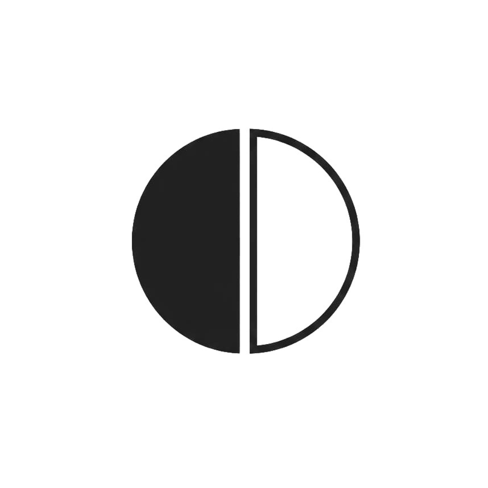
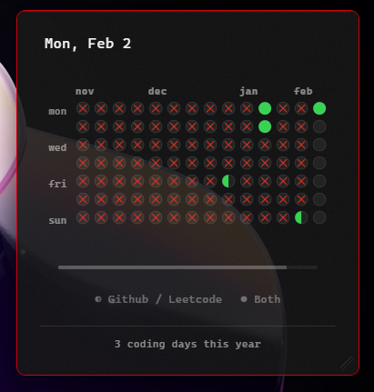
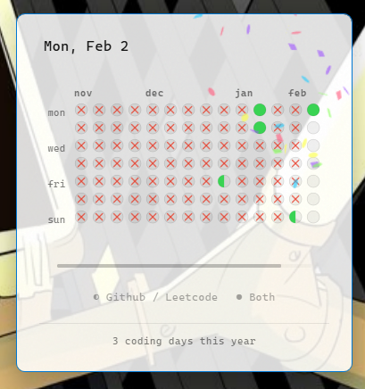

# Chore

<div align="center">



**A minimal desktop widget for tracking your daily coding habits with a GitHub-style heatmap**

[](https://github.com/yourusername/chore/releases)
[](https://github.com/yourusername/chore)
[](LICENSE)

[Download Latest Release](https://github.com/yourusername/chore/releases) • [Report Bug](https://github.com/yourusername/chore/issues) • [Request Feature](https://github.com/yourusername/chore/issues)

</div>

---

## 📸 Screenshots

<div align="center">
  
  
  <p><i>Chore adapts to your system theme automatically</i></p>
</div>

---

## ✨ Features

- **🎯 GitHub-Style Heatmap** - Visual year-long contribution graph with 3 states:
  - Empty (no activity)
  - Half-filled (GitHub OR LeetCode)
  - Full (both completed)
  
- **❌ Missed Day Indicator** - Red crosses show past days you missed

- **🎊 Celebration Confetti** - Satisfying animation when you complete both tasks

- **⏰ Progress Bar** - Live countdown showing time remaining in the current day

- **🖱️ One-Click Tracking** - Click circles to cycle through states

- **🪟 Always Accessible** - System tray integration with show/hide controls

- **🎨 Theme-Aware** - Automatic dark/light mode following system preferences

- **💾 Offline-First** - All data stored locally with SQLite

- **🚀 Lightweight** - Built with Tauri (Rust + WebView2), ~50MB memory footprint

---

## 🎮 How It Works

Click any day's circle to track your progress:

1. **Empty** → **Half-filled** (one task done)
2. **Half-filled** → **Full** (both tasks done) 🎉
3. **Full** → **Empty** (reset)

The widget remembers your streak and displays:
- **Month labels** across the top
- **Day-of-week labels** on the left
- **Total coding days** in the footer
- **Time remaining** when hovering over the progress bar

---

## 📦 Installation

### Option 1: Installer (Recommended)

1. Download `chore_0.1.1_x64-setup.exe` from [Releases](https://github.com/yourusername/chore/releases)
2. Run the installer (no admin required)
3. Launch **Chore** from Start Menu or Desktop

### Option 2: Portable

1. Download `chore_0.1.1_x64.msi`
2. Extract and run `chore.exe`
3. Pin the tray icon for quick access

### System Requirements

- **OS**: Windows 10/11 (64-bit)
- **Runtime**: WebView2 (auto-installed if missing)
- **Disk Space**: ~30 MB

---

## 🚀 Usage

### First Launch

The widget appears on your desktop automatically. You can:

- **Click circles** to mark GitHub/LeetCode completion
- **Drag the header** to reposition the widget
- **Hover over bars** for tooltips

### Tray Menu

Right-click the system tray icon:

- **Show Widget** - Bring the widget to front
- **Hide Widget** - Minimize to tray
- **Quit** - Close the application

### Keyboard Shortcuts

- None yet (coming soon!)

---

## 🛠️ Tech Stack

- **Backend**: [Tauri](https://tauri.app/) (Rust)
- **Frontend**: React 19 + TypeScript + Vite
- **Database**: SQLite (via sqlx)
- **UI Effects**: canvas-confetti
- **Styling**: CSS with glassmorphism

---

## 🎨 Customization

Want to tweak the colors or layout? Edit:

- **Colors**: `src/App.css` (CSS variables)
- **Window size**: `src-tauri/tauri.conf.json`
- **Database**: `src-tauri/src/db.rs`

Then rebuild:
```bash
pnpm install
pnpm tauri build
```

---

## 🗺️ Roadmap

- [ ] GitHub/LeetCode API integration (auto-tracking)
- [ ] Custom themes and color schemes
- [ ] Streak statistics and insights
- [ ] Export/import data
- [ ] Multi-platform support (macOS, Linux)
- [ ] Settings panel
- [ ] Launch on startup option

---

## 🤝 Contributing

Contributions are welcome! Feel free to:

1. Fork the repository
2. Create a feature branch (`git checkout -b feature/amazing-feature`)
3. Commit your changes (`git commit -m 'Add amazing feature'`)
4. Push to the branch (`git push origin feature/amazing-feature`)
5. Open a Pull Request

---

## 📝 License

This project is licensed under the MIT License - see the [LICENSE](LICENSE) file for details.

---

## 💡 Inspiration

Inspired by GitHub's contribution graph and the daily coding challenge culture on LeetCode. Built for developers who want a simple, beautiful way to track their practice consistency.

---

<div align="center">

**Made with ❤️ by developers, for developers**

[⭐ Star this repo](https://github.com/yourusername/chore) if you find it useful!

</div>
